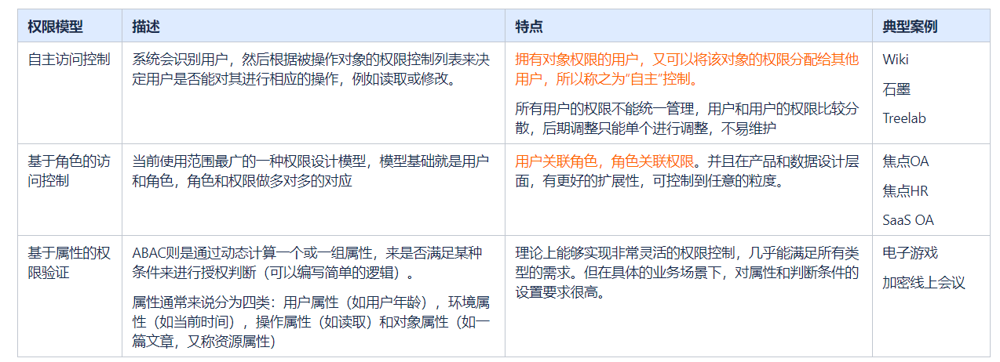

# 01 业务情景归纳

- RBAC 基础Role Based Access Control 模型
- 基于组织架构的RBAC
  - 基于岗位：指定岗位的员工可以进行某些操作
  - 基于部门、公司、集团：指定的公司/部门拥有某些权限
- 前端路由的权限控制
  - 菜单项的展示
  - 应用的可见/可用
- 自主访问控制
- 基于属性的权限验证

# 02 权限模型

## 2.1 模型组合

**角色访问 + 自主访问**

e.g 创新管理

- 自主访问的对象：创新申请附件
- 模型之间的优先级：自主访问 > 角色访问。拥有管理员权限的人员，依旧不能查看创新附件。
- 创新附件目前没有管理与授权后台。现在是指定只有一个员工（石楠）可见。

## 2.2 权限点

**权限点的分类**

常见的权限点可以分为：

1）页面

2）功能 / 接口

3）数据

普遍都是把页面作为权限的第一道切割点，在页面的基础上再进行功能 / 接口的权限控制，最后在功能上再进行数据的范围控制。

但是有时候，页面本身的设置就涵盖了数据范围的控制，例如 “我的申请”、“我的审批”

【案例一】拥有页面权限，但是不拥有页面上某个功能权限

SaaS OA系统，拥有查看新闻公告页面的用户，不一定拥有新建 / 编辑 / 删除 这些功能权限。普通员工点击右侧删除按钮提交时，会报错

【案例二】拥有页面权限与功能权限，但是只拥有部分数据权限

HR招聘系统中，同样是候选人列表，总部人事管理员可以看到全部候选人；驻外的招聘助理只能看到自己所在区域的候选人；每个公司只能看到投递到自己公司的候选人。

## 2.3 权限的分发

**【中心发放】**

系统设置一个超级管理员，超级管理员或者超级管理员指定的下级管理员，设置用户的权限。

**【继承式发放】**

超级管理员拥有所有权限点。超级管理员授权给不同的用户不同的权限。用户可以授权自己已经拥有的权限给其他用户。

**【混合型发放】**

管理员拥有最高权限，可以授权给普通用户所有权限。普通用户拥有某权限后，即可将某权限授权给其他用户。

## 2.4 权限的管理

在一个主应用，关联多个子应用时，权限的管理一般也分为两种模式。

**【集中式管理】**

所有的权限分发、用户权限的查看，都在一个地方统一管理。中心化验证权限。例如焦点OA。管理员在权限中心可以设置

1）用户使用各个子应用的权限

2）用户在各个子应用内部的业务权限

**【分散式管理】**

主应用只负责子应用的使用权限，每个子应用内部的业务权限在每个子应用内单独管理。例如钉钉。

管理员在权限中心可以设置

1）每个员工是否可以使用各个应用

子应用内部设置

1）子应用的管理员

2）子应用的管理员在子应用中设置其他用户的应用内权限

两种管理方式没有优劣之分，根据不同的用户去需求决定使用哪一种模型。

# 03 市场赛道了解

# 06 代码执行分析

- Role 角色
- Entity 实体
  - User 用户
  - dept 部门
  - company 公司
  - job 岗位
- Node 权限点
  - page 页面
  - api 接口
  - app 应用
- Data 数据范围
- Object 数据对象

